<p align="center">
  <a href="https://github.com/luc-dion/FlexLayout">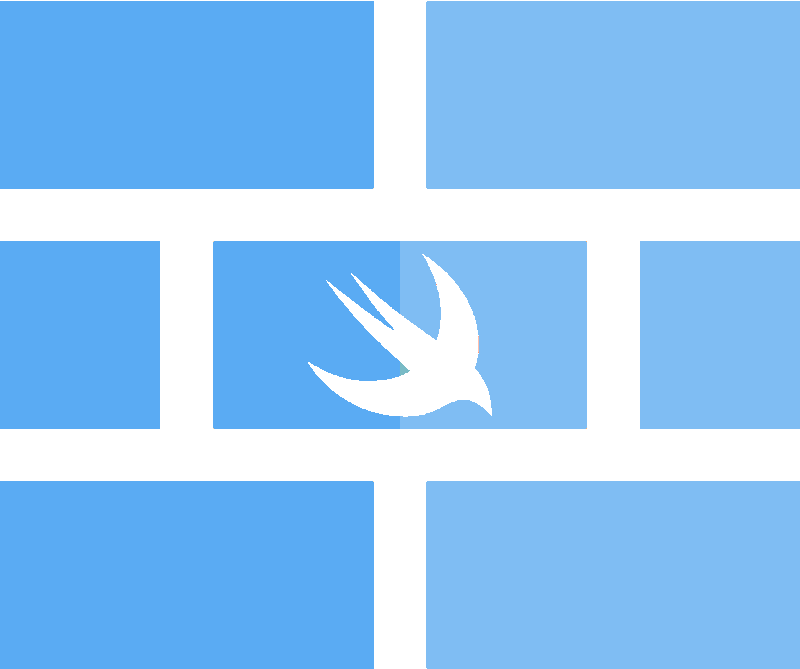</a>
</p>

<h1 align="center" style="color: #376C9D; font-family: Arial Black, Gadget, sans-serif; font-size: 3em">FlexLayout</h1>
 
<p align="center">
  <a href=""></a>
  <a href="https://travis-ci.org/luc-dion/FlexLayout"></a>
  <a href="https://codecov.io/gh/luc-dion/FlexLayout"></a>
  <a href='https://img.shields.io/cocoapods/v/FlexLayout.svg'></a>
  <a href="https://raw.githubusercontent.com/luc-dion/FlexLayout/master/LICENSE"></a>
  <!--<a href='https://dashboard.buddybuild.com/apps/5978e7ec5aa5ac00019e8e87/build/latest?branch=dev'></a>-->
</p>

<br>

FlexLayout gently wraps [facebook/yoga](https://github.com/facebook/yoga) flexbox implementation in a concise, and chainable syntax.

### WARNING: This project is not ready yet and its still under development. Thanks for coming back later. 


### Requirements
* iOS 8.0+
* Xcode 8.0+
* Swift 3.0+

### Content

* [Introduction example](#intro_usage_example)
* [FlexLayout principles and philosophy](#introduction)
* [Documentation](#documentation)
	* [Creation, modification and definition of flexbox containers](#create_modify_define_containers)
	* [Flexbox containers properties](#containers_properties)
	* [Flexbox items properties](#intems_properties)
	* [Absolute positionning](#absolute_positionning)
	* [Adjusting the size](#adjusting_size)
		* [Width, height and size](#width_height_size), 
		* [minWidth, maxWidth, minHeight, maxHeight](#minmax_width_height_size)
		* [Aspect Ratio](#aspect_ratio)
	* [Margins](#margins), [Paddings](#paddings), [Borders](#borders)
* [Performance](#performance)
* [FAQ](#faq)
* [Comments, ideas, suggestions, issues, ....](#comments)
* [Installation](#installation)

<br>

**FlexLayout + PinLayout**

<a href="https://github.com/mirego/PinLayout">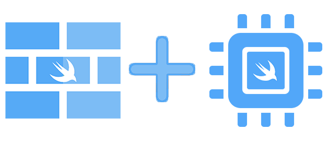</a>

:pushpin: **FlexLayout** is a companion of **[PinLayout](https://github.com/mirego/PinLayout)**. They share a similar syntax and method names (ex: width, height, minWidth, maxWidth, marginTop, marginHorizontal, ...). PinLayout is a lower level layout framework greatly inspired by CSS absolute positionning, it is particularly useful for greater control and animations. PinLayout can layout anything, but for many situations FlexLayout is even more simple.

<br>

## FlexLayout Introduction example <a name="intro_usage_example"></a>
###### Example:
This example layout multiples views using column and row flexboxes inside a flex container.

Two steps to use a flexbox container:

1. **Setup the container**: Initialize your flexbox structure. Note that it is also possible to alter it later. 
2. **Layout the container**: The layout of the container should be done from `layoutSubviews()` (or `willTransition(to: UITraitCollection, ...)` and `viewWillTransition(to: CGSize, ...)`). 
	1. First you must layout the flexbox container, i.e. position it and optionnaly set its size. 
	2. Then layout the flexbox children using Flex method `layout()`.


```swift
init() {
   super.init(frame: .zero)

   // Column flex container
   rootFlexContainer.flex.padding(12).define { (flex) in
        // Row flex container
        flex.addContainer().direction(.row).define { (flex) in
            flex.addItem(imageView).width(100).aspectRatio(of: imageView)
            
            // Column flex container
            flex.addContainer().paddingLeft(12).grow(1).define { (flex) in
                flex.addItem(segmentedControl).marginBottom(12).grow(1)
                flex.addItem(label)
            }
        }
        
        flex.addContainer().height(1).marginTop(12).backgroundColor(.lightGray)
        flex.addItem(bottomLabel).marginTop(12)
    }
}

override func layoutSubviews() {
    super.layoutSubviews() 

    // 1) Layout the flex container. This example use PinLayout for that purpose, but it could be done 
    //    also by setting the rootFlexContainer's frame:
    //       rootFlexContainer.frame = CGRect(x: 0, y: topLayoutGuide, 
    //                                        width: frame.width, height: rootFlexContainer.height)
    rootFlexContainer.pin.top().left().width(100%).marginTop(topLayoutGuide)

    // 2) Then let the flexbox container layout itself. Here the container's height will be adjusted automatically.
    rootFlexContainer.flex.layout(mode: .adjustHeight)
}
``` 

<br>

## FlexLayout principles and philosophy <a name="introduction"></a>

* Flexbox layouting is simple, powerfull and fast.
* FlexLayout syntax is concise and chainable.
* FlexLayout/yoga is incredibly fast, its even faster than manual layout. See performances below.
* The source code structure matches the flexbox structure, making it easier to understand and modify. Flex containers are defined on one line, and its items (children) are imbricated. This makes the flexbox structure much more visual and easy to understand.

NOTE: FlexLayout wraps [facebook/yoga](https://github.com/facebook/yoga) implementation and expose all its features. So note that on this documentation we will refer to FlexLayout, but this also applies to Yoga.

<br>

## Variation from CSS flexbox
FlexLayout default properties are different from CSS flexbox. FlexLayout use the same default properties as Yoga/ReactNative flexbox.
....

* In many CSS methods and properties name, the keyword `flex` was added to control name conflicts. FlexLayout removed this keyword for being more concise and removed this unecessary keyword:

	| FlexLayout Name     | CSS Name | React Native Name |
	|---------------------|----------|-------------------|
	| **`direction`** | `flex-direction` | `flexDirection` |
	| **`wrap`** | `flex-wrap` | `flexWrap` |
	| **`grow`** | `flex-grow` | `flexGrow` |
	| **`shrink`** | `flex-shrink` | `flexShrink` |
	| **`basis`** | `flex-basis` | `flexBasis` |
	| **`start`** | `flex-start` | `flexStart` |
	| **`end`** | `flex-end` | `flexEnd` |
	
	
* Default properties:

	| Property     | FlexLayout default value | CSS default value | React Native default value |
	|--------------|--------------------------|-------------------|----------------------------|
	| **`direction`** | column | row | column |
	| **`justifyContent`** | start | start | start |
	| **`alignItems`** | stretch | stretch | stretch |
	| **`alignSelf`** | auto | auto | auto |
	| **`alignContent`** | start | stretch | start |
	| **`grow`** | 0 | 0 | 0 |
	| **`shrink`** | 1 | 1 | 0 |
	| **`basis`** | 0 | auto | 0 |

* **FlexLayout additions**: 
	* addItem()
	* addContainer()
	* define()
	* layout()
	* isIncludedInLayout()
	* markAsDirty()
	* intrinsicSize
	* sizeThatFits()

	
NOTE: **FlexLayout** doesn't support the flexbox `order` property. The order is  determined by the flex container's `UIView.subviews` array. 

<br>

# Documentation <a name="documentation"></a>

Flexbox is pretty easy and straightforward to use. The defining aspect of the flexbox is the ability to alter its items, width, height to best fill the available space on any display device. A flex container expands its items to fill the available free space or shrinks them to prevent overflow.

The flex layout is constituted of parent container referred as **flex container** and its immediate children which are called **flex items**. A flex item can also be a flex container, i.e. it is possible to add other flex items to it.

| Flexbox term     | Definition |
|---------------------|----------|-------------------|
| **`main-axis`** | The main axis of a flex container is the primary axis along which flex items are laid out. The main-axis direction is set using the `direction()` property. |
| **`cross-axis`** | The axis perpendicular to the main axis is called the cross axis. Its direction depends on the main axis direction |
	
In the following sections we will see:

1. How to create, modifiy and defines flex containers and items.
2. Flexbox container's properties
3. Flexbox item's properties

<br>

## 1. Creation, modification and definition of flexbox containers <a name=" <a name="intro_usage_example"></a>

### addItem(:UIView)
- Applies to: `flex containers`
- Parameter: UIView
- Returns: FlexLayout interface of the newly added flex item.

This methods adds a flex item (UIView) to a flex container. Internally the methods adds the UIView has a subviews and enables flexbox.


###### Usage examples:
```swift
   view.flex.addItem(imageView).width(100).aspectRatio(1)
```
<br>

### addContainer()
- Applies to: `flex containers`
- Returns: FlexLayout interface of the newly created flex item.

This method is similar to `addItem()` except that it also creates the flex container's UIView. Internally the method creates a UIView, adds it has a subviews and finaly enables flexbox. This is useful to add a flex container easily when you don't need to refered to it later.

###### Usage examples:
```swift
	view.flex.addContainer().direction(.row).padding(10)
```
<br>

### define()
- Applies to: `flex containers`
- Parameter: Closure of type `(flex: Flex) -> Void`

This method is used to structure your code so that it matches the flexbox structure. The method takes as parameter a closure with a single parameter called `flex`. This parameter is in fact the view's flex interface, it can be used to adds other flex items and containers. 

###### Usage examples:
```swift
  view.flex.addContainer().define { (flex) in
      flex.addItem(imageView).grow(1)
		
      flex.addContainer().direction(.row).define { (flex) in
          flex.addItem(titleLabel).grow(1)
          flex.addItem(priceLabel)
      }
  }
```

The same results can also be obtained without using the `define()` method, but the results is not as elegant:

```swift
   let columnContainer = UIView()
   columnContainer.flex.addItem(imageView).grow(1)
   view.flex.addItem(columnContainer)
		
   let rowContainer = UIView()
   rowContainer.flex.direction(.row)
   rowContainer.flex.addItem(titleLabel).grow(1)
   rowContainer.flex.addItem(priceLabel)
   columnContainer.flex.addItem(rowContainer)
```

**Avantages of using `define()`**:

- The source code structure matches the flexbox structure, making it easier to understand and modify.
	- Changing a flex item order, its just moving up/down its line/block that defines it.
	- Moving a flex item from one container to another is just moving line/block that defines it.
- The structure looks more similar to how HTML and React Native defines it.
- Inside the `define`'s closure, you can do whatever you want to fill the flexbox container, you can use `for` loops, iterates arrays of data, call functions, ...
 
 
### Accessing flex items UIView <a name="accessing_flexbox_view"></a>
It is possible to access the flex items's UIView using `flex.view`. This is particularly usefull when using `Flex.define()` method.

###### Example:
This example creates a flexbox container and sets its background color and add rounded corners.


```swift
    flex.createBox().direction(.row).padding(20).alignItems(.center).define({ (flex) in
        flex.createBox().width(50).height(50).define({ (flex) in
            flex.view.backgroundColor = UIColor.red
            flex.view.layer.cornerRadius = 10
        }}
    })
``` 

Another possible solution:

```swift
    flex.createBox().direction(.row).padding(20).alignItems(.center).define({ (flex) in
        let container = UIView()
        container.backgroundColor = UIColor.red
        container.layer.cornerRadius = 10
        
        flex.addChild(container).width(50).height(50)
    })
``` 
<br>

### layout()
- Applies to: `flex containers`
- Values: `fitContainer` / `adjustWidth` / `adjustHeight`
- Default value: `fitContainer `

`func layout(mode: LayoutMode = . fitContainer)`

The method layout the flex container's children.

**Three different layout mode is available:**

1. fitContainer: This is the default mode when no parameter is specified. Children are layouted **inside** the container's size (width and height). 
2. adjustHeight: In this mode children are layouted **using only the container's width**. The container's height will be adjusted to fit the flexbox's children
3. adjustWidth: In this mode children are layouted **using only the container's height**. The container's width will be adjusted to fit the flexbox's children

<br>

## 2. Flexbox containers properties  <a name="containers_properties"></a>
This section describe all flex container's properties.

### direction() 
- Applies to: `flex containers`
- Values: `column` / `columnReverse` / `row` / `rowReverse`
- Default value: `column`
- CSS name: `flex-direction` 

The `direction` property establishes the main-axis, thus defining the direction flex items are placed in the flex container.

The `direction` property specifies how flex items are laid out in the flex container, by setting the direction of the flex container’s main axis. They can be laid out in two main directions,  like columns vertically or like rows horizontally.

Note that row and row-reverse are affected by the layout direction (see `layoutDirection` property) of the flex container. If its text direction is LTR (left to right), row represents the horizontal axis oriented from left to right, and row-reverse from right to left; if the direction is rtl, it's the opposite.

NEW: This property is used to specify the direction of the flex container’s main axis, thus defining the direction flex items are placed in the flex container


| Value | Result | Description |
|---------------------|:------------------:|---------|
| **column** (default) 	| | Top to bottom |
| **columnReverse** | 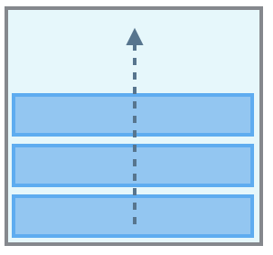| Bottom to top |
| **row** | 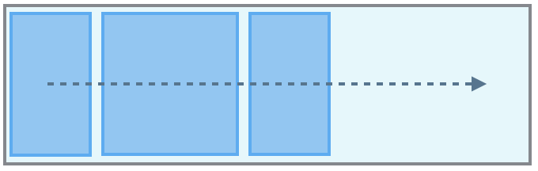| Same as text direction |
| **rowReverse** | 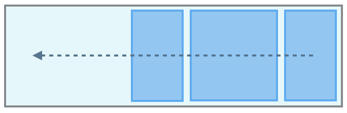| opposite to text direction |


###### Usage examples:
```swift
	view.flex.direction(.column)  // Not required, defaut value. 
	view.flex.direction(.row)
```
<br/>

### wrap()
- Applies to: `flex containers`
- Values: `noWrap` / `wrap` / `wrapReverse`
- Default value: `noWrap`
- CSS name: `flex-wrap` 

The `wrap` property controls whether the flex container is single-lined or multi-lined, and the direction of the cross-axis, which determines the direction in which the new lines are stacked in.

Reminder: the cross axis is the axis perpendicular to the main axis. Its direction depends on the main axis direction.

NEW: By default the flex container fits all flex items into one line. Using this property we can change that. We can tell the container to lay out its items in single or multiple lines, and the direction the new lines are stacked in.

|                     	| direction(.column) | direction(.row) | Description|
|---------------------	|:------------------:|:---------------:|--------------|
| **noWrap** (default) 	| 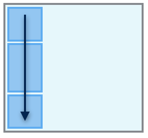| 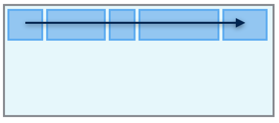| Single-line which may cause the container to overflow. NEW: Flex items are displayed in one row and by default they are shrunk to fit the flex container’s width |
| **wrap** | 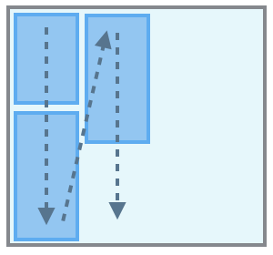| 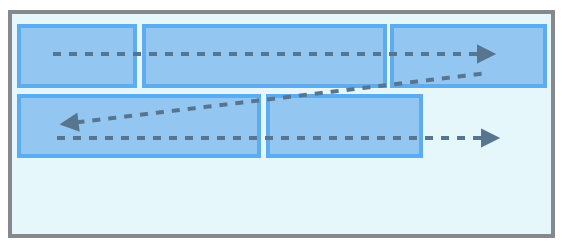| Multi-lines, direction is defined by `direction()`. NEW: Flex items are displayed in multiple rows if needed from left-to-right and top-to-bottom  |
| **wrapReverse**	| 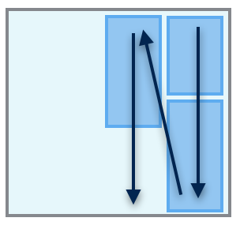| 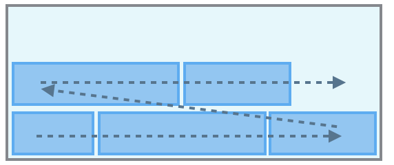| Multi-lines, opposite to direction defined by `direction()`. NEW: Flex items are displayed in multiple rows if needed from left-to-right and bottom-to-top |

###### Usage examples:
```swift
	view.flex.wrap(.nowrap)  // Not required, defaut value. 
	view.flex.wrap(.wrap)
```
<br/>

### justifyContent()
- Applies to: `flex containers`
- Values: `start` / `end` / `center` / `spaceBetween` / `spaceAround`
- Default value: `start`
- CSS name: `justify-content` 

The `justifyContent` property defines the alignment along the main-axis of the current line of the flex container. It helps distribute extra free space leftover when either all the flex items on a line have reached their maximum size. For example, if children are flowing vertically, justifyContent controls how they align vertically. 

NEW: justify-content property aligns flex items along the main axis of the current line of the flex container. It helps distribute left free space when either all the flex items on a line are inflexible, or are flexible but have reached their maximum size.

|                     	| direction(.column) | direction(.row) |
|---------------------	|:------------------:|:---------------:|
| **start** (default) 	| 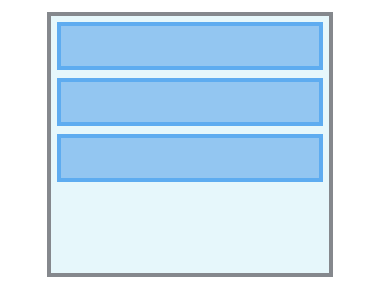| 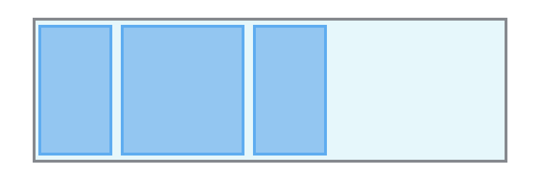|
| **end**	| 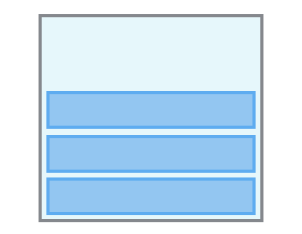| 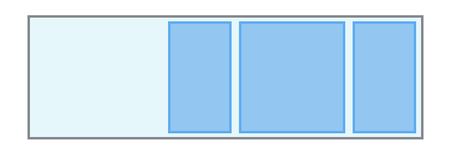|
| **center** 	| 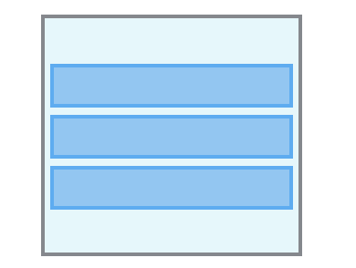| 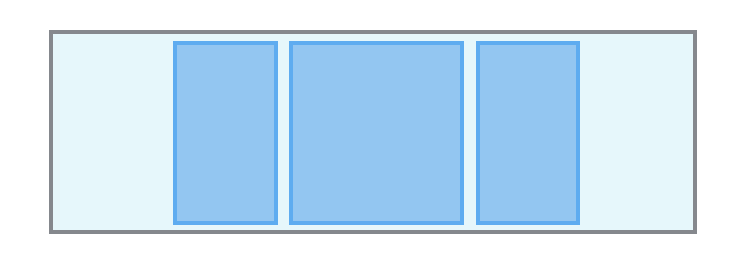|
| **spaceBetween** 	| 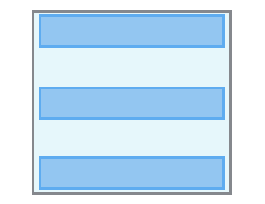| 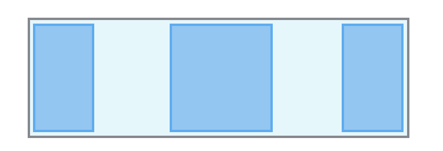|
| **spaceAround** 	| 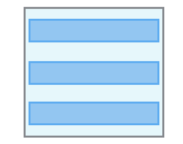| 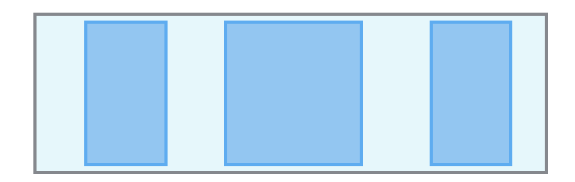|

###### Usage examples:
```swift
	view.flex.justifyContent(.start)  // defaut value. 
	view.flex.justifyContent(.center)
```
<br/>

### alignItems()
- Applies to: `flex containers`
- Values: `stretch` / `start` / `end` / `center` / `baseline`
- Default value: `stretch `
- CSS name: `align-items` 

The `alignItems` property defines how flex items are laid out along the cross axis on the current line. Similar to justifyContent but for the cross-axis (perpendicular to the main-axis). For example, if children are flowing vertically, alignItems controls how they align horizontally. 

NEW: The align-items property defines how flex items are laid out along the cross axis on the current line. You can think of it as the justify-content version for the cross-axis.

|                     	| direction(.column) | direction(.row) |
|---------------------	|:------------------:|:---------------:|
| **stretch** (default) 	| 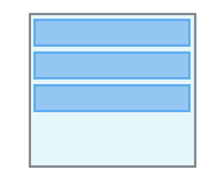| 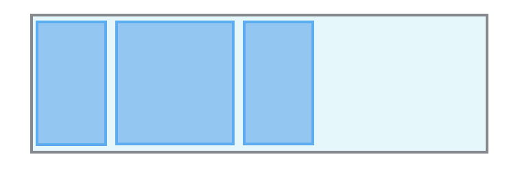|
| **start**	| 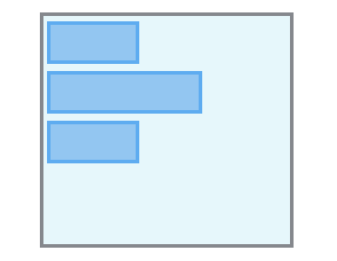| 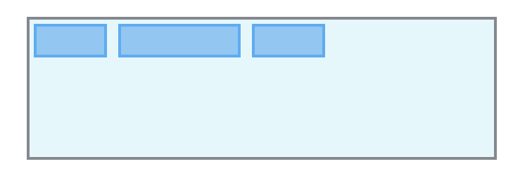|
| **end**	| 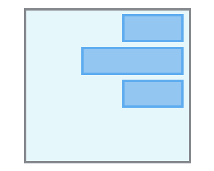| 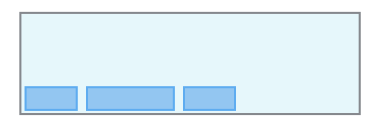|
| **center** 	| 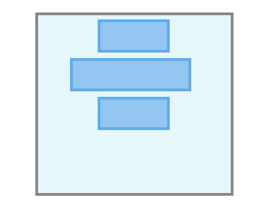| 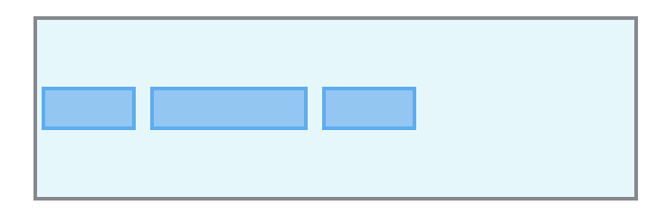|
| **baseline** 	| | 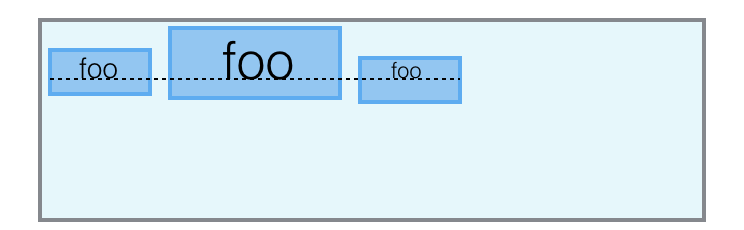|

<br/>

### alignSelf()
- Applies to: `flex containers`
- Values: `auto` / `stretch` / `start` / `end` / `center` / `baseline`
- Default value: `auto`
- CSS name: `align-self` 

The `alignItems` property controls how a child aligns in the cross direction, overriding the alignItems of the parent. For example, if children are flowing vertically, alignSelf will control how the flex item will align horizontally. 

The `auto` value means use the flex container `alignItems` property. See `alignItems` for documentation of the other values.

NEW: This align-self property allows the default alignment (or the one specified by align-items) to be overridden for individual flex items. Refer to align-items explanation for flex container to understand the available values.

<br/>

### alignContent()
- Applies to: `flex containers`
- Values: `start` / `end` / `center` / `stretch` / `spaceBetween` / `spaceAround`
- Default value: `start`
- CSS name: `align-content`  

The align-content property aligns a flex container’s lines within the flex container when there is extra space in the cross-axis, similar to how justifyContent aligns individual items within the main-axis.

Note, `alignContent` has no effect when the flexbox has only a single line.

NEW: The align-content property aligns a flex container’s lines within the flex container when there is extra space in the cross-axis (similar to how justify-content aligns individual items within the main-axis)

|                     	| direction(.column) | direction(.row) |
|---------------------	|:------------------:|:---------------:|
| **start** (default) 	| | 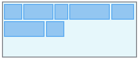|
| **end**	| 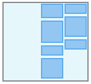| |
| **center** 	| | 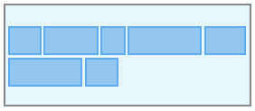|
| **stretch**	| 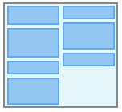| |
| **spaceBetween** | 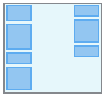 | |
| **spaceAround** | 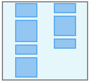 | |

<br/>


### layoutDirection()

YOGA DOC: The web has limited support for Right-to-Left (RTL) layouts. It does a pretty good job when it comes to text alignment and text rendering, but lacks the features needed to build fully RTL compatible UIs. Therefore, Yoga has adopted Start and End values for Margin, Padding, Border, and Position properties.

klayoutDirection

With Start and End, you can specify these properties in your UI without having to think about whether your item will show up on the left or the right side of the screen (depending on the person’s language setting). Yoga automatically handles this for you.

The Direction property controls this behavior. Direction defaults to Inherit on all nodes except the root which defaults to LTR. It is up to you to detect the user’s preferred direction (most platforms have a standard way of doing this) and setting this direction on the root of your layout tree.


## 3. Flexbox items properties <a name="intems_properties"></a>
This section describe all flex items's properties.

:pushpin: Remembers that flex containers are also flex items, so all these properties also applies to containers.

### grow 
- Applies to: `flex items`
- Value type: CGFloat
- Default value: 0
- CSS name: `flex-grow` 

The `grow` property defines the ability for a flex item to grow if necessary. It accepts a unitless value that serves as a proportion. It dictates what amount of the available space inside the flex container the item should take up.

A grow value of 0 (default value) keeps the view's size in the main-axis direction. If you want the view to use the available space set a grow value > 0.

For example, if all items have `grow` set to 1, every child will set to an equal size inside the container. If you were to give one of the children a value of 2, that child would take up twice as much space as the others.

NEW: This property specifies the flex grow factor, which determines how much the flex item will grow relative to the rest of the flex items.

<br>

### shrink
- Applies to: `flex items`
- Value type: CGFloat
- Default value: 1
- CSS name: `flex-shrink` 

It specifies the "flex shrink factor", which determines how much the flex item will shrink relative to the rest of the flex items in the flex container when there isn't enough space on the main-axis.

When omitted, it is set to 1 and the flex shrink factor is multiplied by the flex `basis` when distributing negative space.

A shrink value of 0 keeps the view's size in the main-axis direction. Note that this may cause the view to overflow its flex container.

NEW: The flex-shrink specifies the flex shrink factor, which determines how much the flex item will shrink relative to the rest of the flex items

<br>

### basis
- Applies to: `flex items `
- Value type: CGFloat
- Default value: 0
- CSS name: `flex-basis` 

This property takes the same values as the width and height properties, and specifies the initial size of the flex item, before free space is distributed according to the grow and shrink factors.

NEW: This property takes the same values as the width and height properties, and specifies the initial main size of the flex item

YOGA DOC: The FlexBasis property is an axis-independent way of providing the default size of an item on the main axis. Setting the FlexBasis of a child is similar to setting the Width of that child if its parent is a container with FlexDirection = row or setting the Height of a child if its parent is a container with FlexDirection = column. The FlexBasis of an item is the default size of that item, the size of the item before any FlexGrow and FlexShrink calculations are performed.


<br>

### isIncludedInLayout()
- Applies to: `flex items`
- Parameter: Bool

It is possible to control dynamically if a flexbox's UIView is included or not in the flexbox layouting. 
When a flexbox's UIView is excluded, FlexLayout won't layout the view and its children views.

**Property & Method:**

* `isIncludedInLayout(: Bool)`

FlexLayout automatically includes the UIView when:
* The first time `UIView.flex` property is accessed
* When a child view is added to a flexbox container using `addChild(:UIView)`
* When a flexbox container is created using `addContainer()`

<br>

### markAsDirty()
- Applies to: `flex items`
- Parameter: Bool

In the event that you need to another layout pass on a view you can mark it dirty via `flex.markAsDirty()`

Dirty flag propagates to the root of the flexbox tree ensuring that when any item is invalidated its whole subtree will be re-calculated

### sizeThatFits()
- Applies to: `flex items`
- Parameter: CGSize

Returns the item size when layouted in the specified frame size.

###### Usage Example:
Get the size of view when layouted in a container with a width of 200 pixels.

```swift
    let layoutSize = viewA.flex.sizeThatFits(CGSize(width: 200, height: CGFloat.greatestFiniteMagnitude)
```

### intrinsicSize
- Applies to: `flex items`
- Parameter: None

Item natural size, considering only properties of the view itself. Independent of the item frame.

## 4. Absolute positionning: left / top / right / bottom / start / end  <a name="absolute_positionning"></a>
- Applies to: `flex items`
- Parameter: CGFloat

YOGA DOC: The Position property tells Flexbox how you want your item to be positioned within its parent. There are 2 options:
* Relative (default)
* Absolute

An item marked with Position = Absolute is positioned absolutely in regards to its parent. This is done through 6 properties:

* Left - controls the distance a child’s left edge is from the parent’s left edge
* Top - controls the distance a child’s top edge is from the parent’s top edge
* Right - controls the distance a child’s right edge is from the parent’s right edge
* Bottom - controls the distance a child’s bottom edge is from the parent’s bottom edge
* Start - controls the distance a child’s start edge is from the parent’s start edge
* End - controls the distance a child’s end edge is from the parent’s end edge

Using these options you can control the size and position of an absolute item within its parent. Because absolutely positioned children don’t effect their siblings layout Position = Absolute can be used to create overlays and stack children in the Z axis.


    public func left(_ value: CGFloat) -> Flex {
    public func top(_ value: CGFloat) -> Flex {
    public func right(_ value: CGFloat) -> Flex {
    public func bottom(_ value: CGFloat) -> Flex {
    public func start(_ value: CGFloat) -> Flex {
    public func end(_ value: CGFloat) -> Flex {
    
<br>

## 5. Adjusting the size  <a name="adjusting_size"></a> 

### Width and height and size <a name="width_height_size"></a>

FlexLayout has methods to set the view’s height and width.

**Methods:**

* `width(_ width: CGFloat)` / `width(percent: Percent)`  
The value specifies the view's width in pixels. Value must be non-negative.
* `height(_ height: CGFloat)` / `height(percent: Percent)`  
The value specifies the view's height in pixels. Value must be non-negative.
* `size(_ size: CGSize)` / `size(_ percent: Percent)`  
The value specifies view's width and the height in pixels. Values must be non-negative.
* `size(_ sideLength: CGFloat)`  
The value specifies the width and the height of the view in pixels, creating a square view. Values must be non-negative.


###### Usage examples:
```swift
	view.flex.width(100)
	view.flex.width(of: view1)
	
	view.flex.height(200)
	
	view.flex.size(of: view1)
	view.flex.size(250)
```
<br>

### minWidth, maxWidth, minHeight, maxHeight <a name="minmax_width_height_size"></a>

FlexLayout has methods to set the view’s minimum and maximum width, and minimum and maximum height. 

YOGA DOC: Using MinWidth, MinHeight, MaxWidth, and MaxHeight gives you increased control over the final size of items in a layout. By mixing these properties with FlexGrow, FlexShrink, and AlignItems = Stretch, you are able to have items with dynamic size within a range which you control.

An example of when Max properties can be useful is if you are using AlignItems = Stretch but you know that your item won’t look good after it increases past a certain point. In this case, your item will stretch to the size of its parent or until it is as big as specified in the Max property.

Same goes for the Min properties when using FlexShrink. For example, you may want children of a container to shrink to fit on one row, but if you specify a minimum width, they will break to the next line after a certain point (if you are using FlexWrap = Wrap).

Another case where Min and Max dimension constraints are useful is when using AspectRatio.


**Methods:**

* `minWidth(_ width: CGFloat)` 
The value specifies the view's minimum width of the view in pixels. Value must be non-negative.

* `maxWidth(_ width: CGFloat)`  
The value specifies the view's maximum width of the view in pixels. Value must be non-negative.

* `minHeight(_ height: CGFloat)`
The value specifies the view's minimum height of the view in pixels. Value must be non-negative.

* `maxHeight(_ height: CGFloat)`
The value specifies the view's maximum height of the view in pixels. Value must be non-negative.
   
###### Usage examples:
```swift
	view.flex.maxWidth(200)
	view.flex.width(of: view1).maxWidth(250)
	
	view.flex.maxHeight(100)
	view.flex.height(of: view1).maxHeight(200)
```
<br>

### Aspect Ratio <a name="aspect_ratio"></a>
...

YOGA DOC: AspectRatio is a property introduced by Yoga. AspectRatio solves the problem of knowing one dimension of an element and an aspect ratio, this is very common when it comes to videos, images, and other media types. AspectRatio accepts any floating point value > 0, the default is undefined.

* AspectRatio is defined as the ratio between the width and the height of a node e.g. if a node has an aspect ratio of 2 then its width is twice the size of its height.
* AspectRatio respects the Min and Max dimensions of an item.
* AspectRatio has higher priority than FlexGrow
* If AspectRatio, Width, and Height are set then the cross dimension is overridden

<br/>


## 6. Margins <a name="margins"></a>
FlexLayout ....

YOGA DOC: Margin, Padding are similar but have some important differences. By applying Margin to an item you specify the offset a certain edge of the item should have from it’s closest sibling or parent. With Padding on the other hand you specify the offset children should have from a certain edge on the parent. Border behaves nearly identically to Padding and is only separate from Padding to make it easier to implement border effect such as color. In the below illustrations the green box is a child of the dark gray box.


**Methods:**

* `marginTop(_ value: CGFloat)`
* `marginLeft(_ value: CGFloat)`
* `marginBottom(_ value: CGFloat)`
* `marginRight(_ value: CGFloat)`
* `marginHorizontal(_ value: CGFloat)`
* `marginVertical(_ value: CGFloat)`
* `margin(_ value: CGFloat) `
* `margin(_ vertical: CGFloat, _ horizontal: CGFloat)`
* `margin(_ top: CGFloat, _ horizontal: CGFloat, _ bottom: CGFloat)`
* `margin(_ top: CGFloat, _ right: CGFloat, _ bottom: CGFloat, _ left: CGFloat) `

###### Usage examples:
```swift
	view.flex.margin(20)
	view.flex.marginBottom(20)
	view.flex.marginHorizontal(20)
	view.flex.margin(10, 12, 0, 12)
```

<br>

## 7. Paddings <a name="paddings"></a>
FlexLayout ...

**Methods:**

* `paddingTop(_ value: CGFloat)`
* `paddingLeft(_ value: CGFloat)`
* `paddingBottom(_ value: CGFloat)`
* `paddingRight(_ value: CGFloat)`
* `paddingHorizontal(_ value: CGFloat)`
* `paddingVertical(_ value: CGFloat)`
* `padding(_ value: CGFloat) `
* `padding(_ vertical: CGFloat, _ horizontal: CGFloat)`
* `padding(_ top: CGFloat, _ horizontal: CGFloat, _ bottom: CGFloat)`
* `padding(_ top: CGFloat, _ right: CGFloat, _ bottom: CGFloat, _ left: CGFloat) `


###### Usage examples:
```swift
	view.flex.padding(20)
	view.flex.paddingBottom(20)
	view.flex.paddingHorizontal(20)
	view.flex.padding(10, 12, 0, 12)
```

<br>

## 8. Borders <a name="borders"></a>

**Methods:**

* `borderLeft(_ value: CGFloat)`
* `borderTop(_ value: CGFloat)`
* `borderRight(_ value: CGFloat)`
* `borderBottom(_ value: CGFloat)`
* `borderStart(_ value: CGFloat)`
* `borderEnd(_ value: CGFloat)`
* `border(_ value: CGFloat)`

<br>


# FlexLayout's Performance <a name="performance"></a>

FlexLayout's performance has been measured using the nice and simple LayoutKit benchmark. FlexLayout has been added to this benchmark to compare its performance. 

As you can see in the following chart, FlexLayout's performance is as fast as manual layouting, and **between 12x and 16x faster than auto layout**, for all types of iPhone (5/6/6S/7)

These results also means that ** FlexLayout is faster than any layout frameworks that is built over auto layout**. 

[See here more complete details, results and explanation of the benchmark](docs/Benchmark.md).

<p align="center"> Tested on a iPhone 6 iOS 10.3.2</p>
<p align="center">
  
</p>


<br/>

# Links
* THE flexbox CSS reference: [A Complete Guide to Flexbox](https://css-tricks.com/snippets/css/a-guide-to-flexbox/)
* [Interresting Yoga tutorial](https://www.raywenderlich.com/161413/yoga-tutorial-using-cross-platform-layout-engine?utm_source=raywenderlich.com+Weekly&utm_campaign=e7e557ef6a-raywenderlich_com_Weekly_Issue_125&utm_medium=email&utm_term=0_83b6edc87f-e7e557ef6a-414921561)
* https://yoksel.github.io/flex-cheatsheet
* https://developer.mozilla.org/en-US/docs/Web/CSS/CSS_Flexible_Box_Layout/Advanced_layouts_with_flexbox

# Installation <a name="installation"></a>

### CocoaPods

To integrate FlexLayout into your Xcode project using CocoaPods, specify it in your `Podfile`:

```ruby
    pod 'FlexLayout'
```

Then, run `pod install`.

<br/>


## FAQ <a name="faq"></a>

*  **Q: How to keep the view size (width/height)?**  
   **R:** By default view's flex shrink value is set to 1, which reduce the size of the view if the view is bigger than its flex container in the main-axis direction. If the direction is column, the height is adjusted, if the direction is row, the width is adjusted. Setting this value to 0 will keep the view size in the main-axis direction.

<br/>

## Contributing, comments, ideas, suggestions, issues, .... <a name="comments"></a>
For any **comments**, **ideas**, **suggestions**, simply open an [issue](https://github.com/luc-dion/FlexLayout/issues). 

For **issues**, please have a look at [Yoga's issues](https://github.com/facebook/yoga/issues). Your issue may have been already reported. If not, it may be a FlexLayout issue. In this case open an issue and we'll let you know if the issue is related to Yoga's implementation. 

If you find FlexLayout interresting, thanks to **Star** it. You'll be able to retrieve it easily later.

If you'd like to contribute, you're welcome!

<br>


## Changelog
FlexLayout recent history is available in the are documented in the [CHANGELOG](CHANGELOG.md).

<br>

## License
BSD 3-Clause License