<p align="center">
  <a href="https://github.com/layoutBox/FlexLayout">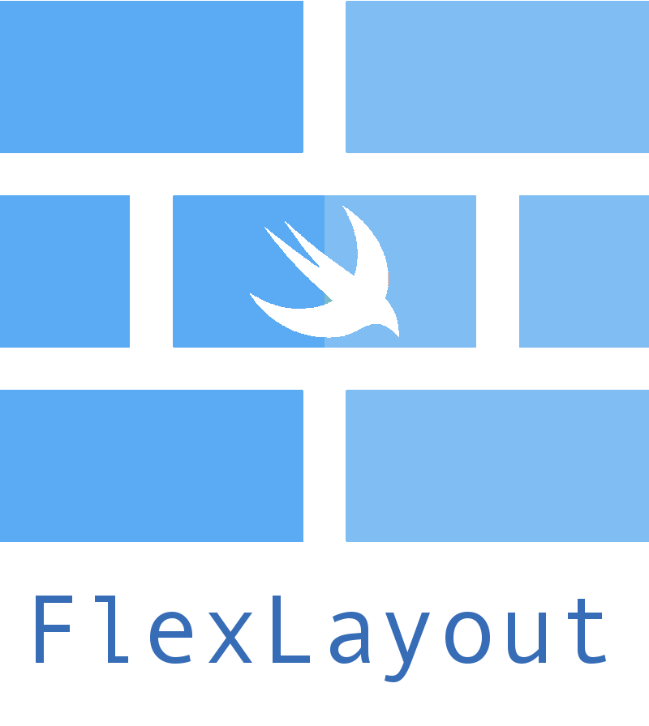</a>
</p>

<p align="center">
  <a href=""></a>
  <a href="https://github.com/layoutBox/FlexLayout/actions/workflows/github-actions-ci.yml"></a>
<!-- <a href='https://coveralls.io/github/layoutBox/FlexLayout?branch=master'></a>-->
  <a href='https://img.shields.io/cocoapods/v/FlexLayout.svg'></a>
  <a href="https://github.com/Carthage/Carthage"></a>
<a href="https://github.com/layoutBox/FlexLayout/issues"></a>
</p></p>

<br>

FlexLayout adds a nice Swift interface to the highly optimized [Yoga](https://github.com/facebook/yoga) flexbox implementation. Concise, intuitive & chainable syntax.

Flexbox is an incredible improvement over UIStackView. It is simpler to use, much more versatile and amazingly performant.

> Yoga is a multiplatform CSS Flexbox implementation (iOS/Android/...). Yoga is also the layout engine of React Native.


### Requirements
* iOS 8.0+
* Xcode 8.0+ / Xcode 9.0+
* Swift 3.0+ / Swift 4.0

### Content

* [Introduction examples](#intro_usage_example)
* [FlexLayout principles and philosophy](#introduction)
* [Performance](#performance)
* [Documentation](#documentation)
	* [Creation, modification and definition of flexbox containers](#create_modify_define_containers)
	* [Flexbox containers properties](#containers_properties)
	* [Flexbox items properties](#intems_properties)
	* [Absolute positioning](#absolute_positioning)
	* [Adjusting the size](#adjusting_size)
		* [Width, height and size](#width_height_size)
		* [minWidth, maxWidth, minHeight, maxHeight](#minmax_width_height_size)
		* [Aspect Ratio](#aspect_ratio)
	* [Margins](#margins)
	* [Paddings](#paddings)
* [API Documentation](#api_documentation)
* [Examples App](#examples_app)
* [FAQ](#faq)
* [Comments, ideas, suggestions, issues, ....](#comments)
* [Installation](#installation)

<br>

:pushpin: FlexLayout is actively updated. So please come often to see latest changes. You can also **Star** it to be able to retrieve it easily later.

<br>

### FlexLayout + PinLayout

<a href="https://github.com/layoutBox/PinLayout"></a>

**FlexLayout** is a companion of **[PinLayout](https://github.com/layoutBox/PinLayout)**. They share a similar syntax and method names. PinLayout is a layout framework greatly inspired by CSS absolute positioning, it is particularly useful for greater fine control and animations. It gives you full control by layouting one view at a time (simple to code and debug).

* A view can be layouted using FlexLayout, PinLayout, or both!
* PinLayout can layout anything, but in situations where you need to layout many views but don't require PinLayout's finest control nor complex animations, FlexLayout is best fitted. 
* A view layouted using PinLayout can be embedded inside a FlexLayout's container and reversely. You choose the best layout framework for your situation. 

<br>
 
<a name="intro_usage_example"></a>
## FlexLayout Introduction examples 
###### Example 1:
This example will layout multiples views using column and row flexbox containers.

Two steps to use a flexbox container:

1. **Setup the container**: Initialize your flexbox structure. Note that it is also possible to alter it later. 
2. **Layout the container**: The layout of the container should be done from `layoutSubviews()` (or `willTransition(to: UITraitCollection, ...)` and `viewWillTransition(to: CGSize, ...)`). 
	1. First you must layout the flexbox container, i.e. position it and optionally set its size. 
	2. Then layout the flexbox children using Flex method `layout()`.

<a href="https://github.com/layoutBox/FlexLayout/blob/master/Example/FlexLayoutSample/UI/Examples/Intro/IntroView.swift">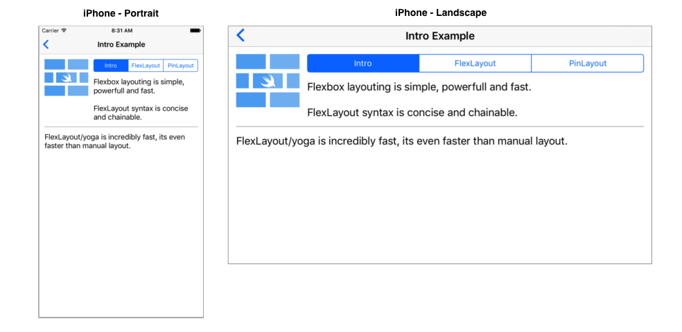</a>

```swift
fileprivate let rootFlexContainer = UIView()

init() {
   super.init(frame: .zero)
   
   addSubview(rootFlexContainer)
   ...

   // Column container
   rootFlexContainer.flex.direction(.column).padding(12).define { (flex) in
        // Row container
        flex.addItem().direction(.row).define { (flex) in
            flex.addItem(imageView).width(100).aspectRatio(of: imageView)
            
            // Column container
            flex.addItem().direction(.column).paddingLeft(12).grow(1).define { (flex) in
                flex.addItem(segmentedControl).marginBottom(12).grow(1)
                flex.addItem(label)
            }
        }
        
        flex.addItem().height(1).marginTop(12).backgroundColor(.lightGray)
        flex.addItem(bottomLabel).marginTop(12)
    }
}

override func layoutSubviews() {
    super.layoutSubviews() 

    // 1) Layout the flex container. This example use PinLayout for that purpose, but it could be done 
    //    also by setting the rootFlexContainer's frame:
    //       rootFlexContainer.frame = CGRect(x: 0, y: 0, 
    //                                        width: frame.width, height: rootFlexContainer.height)
    rootFlexContainer.pin.top().left().width(100%).marginTop(topLayoutGuide)

    // 2) Then let the flexbox container layout itself. Here the container's height will be adjusted automatically.
    rootFlexContainer.flex.layout(mode: .adjustHeight)
}
``` 

:pushpin: This example is available in the [Examples App](#examples_app). See complete [source code](https://github.com/layoutBox/FlexLayout/blob/master/Example/FlexLayoutSample/UI/Examples/Intro/IntroView.swift)

</br>

<a name="intro_usage_example_raywenderlich"></a>
###### Example 2: 
The example implements the [Ray Wenderlich Yoga Tutorial](https://www.raywenderlich.com/161413/yoga-tutorial-using-cross-platform-layout-engine) screen using FlexLayout. 

<a href="https://github.com/layoutBox/FlexLayout/blob/master/Example/FlexLayoutSample/UI/Examples/RaywenderlichTutorial/RaywenderlichTutorialView.swift"></a>

```swift
init() {
   ...

   rootFlexContainer.flex.define { (flex) in
        // Image
        flex.addItem(episodeImageView).grow(1).backgroundColor(.gray)
        
        // Summary row
        flex.addItem().direction(.row).padding(padding).define { (flex) in
            flex.addItem(summaryPopularityLabel).grow(1)
            
            flex.addItem().direction(.row).justifyContent(.spaceBetween).grow(2).define { (flex) in
                flex.addItem(yearLabel)
                flex.addItem(ratingLabel)
                flex.addItem(lengthLabel)
            }
            
            flex.addItem().width(100).height(1).grow(1)
        }
        
        // Title row
        flex.addItem().direction(.row).padding(padding).define { (flex) in
            flex.addItem(episodeIdLabel)
            flex.addItem(episodeTitleLabel).marginLeft(20)
        }
        
        // Description section
        flex.addItem().paddingHorizontal(paddingHorizontal).define { (flex) in
            flex.addItem(descriptionLabel)
            flex.addItem(castLabel)
            flex.addItem(creatorsLabel)
        }
        
        // Action row
        flex.addItem().direction(.row).padding(padding).define { (flex) in
            flex.addItem(addActionView)
            flex.addItem(shareActionView)
        }
        
        // Tabs row
        flex.addItem().direction(.row).padding(padding).define { (flex) in
            flex.addItem(episodesTabView)
            flex.addItem(moreTabView)
        }
        
        // Shows TableView
        flex.addItem(showsTableView).grow(1)
    }
}

override func layoutSubviews() {
    super.layoutSubviews() 

    // 1) Layout the contentView & rootFlexContainer using PinLayout
    contentView.pin.top().bottom().left().right()
    rootFlexContainer.pin.top().left().right()

    // 2) Let the flexbox container layout itself and adjust the height
    rootFlexContainer.flex.layout(mode: .adjustHeight)
    
    // 3) Adjust the scrollview contentSize
    contentView.contentSize = rootFlexContainer.frame.size
}
``` 

:pushpin: This example is available in the [Examples App](#examples_app). See complete [source code](https://github.com/layoutBox/FlexLayout/blob/master/Example/FlexLayoutSample/UI/Examples/RaywenderlichTutorial/RaywenderlichTutorialView.swift)

<br>

<a name="introduction"></a>
## FlexLayout principles and philosophy 
* Flexbox layouting is simple, powerful and fast.
* FlexLayout syntax is concise and chainable.
* FlexLayout/yoga is incredibly fast, it's even faster than manual layout. See [Performance](#performance).
* The source code structure matches the flexbox structure, making it easier to understand and modify. Flex containers are defined on one line, and its items (children) are imbricated. This makes the flexbox structure much more visual and easy to understand.
* Supports left-to-right (LTR) and right-to-left (RTL) languages.

NOTE: FlexLayout wraps [facebook/yoga](https://github.com/facebook/yoga) implementation and expose all its features. So note that on this documentation we will refer to FlexLayout, but this also applies to Yoga.

<br>

<a name="performance"></a>
# FlexLayout's Performance 

FlexLayout's performance has been measured using the [Layout Framework Benchmark](https://github.com/layoutBox/LayoutFrameworkBenchmark). FlexLayout and [PinLayout](https://github.com/layoutBox/PinLayout) has been added to this benchmark to compare their performance. 

As you can see in the following chart, FlexLayout and PinLayout's performance are faster or equal to manual layouting. FlexLayout and PinLayout are **between 8x and 12x faster than UIStackViews**, and this for all types of iPhone (5S/6/6S/7/8/X)

[See here more complete details, results and explanation of the benchmark](docs_markdown/benchmark.md).

<p align="center">
	<a href="docs_markdown/benchmark.md">
	  
	  </a>
</p>


<br/>

## Variation from CSS flexbox

* In many CSS methods and properties name, the keyword `flex` was added to control name conflicts. FlexLayout removed this keyword for being more concise and removed this unecessary keyword:

	| FlexLayout Name     | CSS Name | React Native Name |
	|---------------------|----------|-------------------|
	| **`direction`** | `flex-direction` | `flexDirection` |
	| **`wrap`** | `flex-wrap` | `flexWrap` |
	| **`grow`** | `flex-grow` | `flexGrow` |
	| **`shrink`** | `flex-shrink` | `flexShrink` |
	| **`basis`** | `flex-basis` | `flexBasis` |
	| **`start`** | `flex-start` | `flexStart` |
	| **`end`** | `flex-end` | `flexEnd` |
	
	
* FlexLayout default properties are sligthly different from CSS flexbox. This table resume these difference:

	| Property     | FlexLayout default value | CSS default value | React Native default value |
	|--------------|--------------------------|-------------------|----------------------------|
	| **`direction`** | column | row | column |
	| **`justifyContent`** | start | start | start |
	| **`alignItems`** | stretch | stretch | stretch |
	| **`alignSelf`** | auto | auto | auto |
	| **`alignContent`** | start | stretch | start |
	| **`grow`** | 0 | 0 | 0 |
	| **`shrink`** | 0 | 1 | 0 |
	| **`basis`** | 0 | auto | 0 |
	| **`wrap`** | noWrap | nowrap | noWrap |

* **FlexLayout additions**: 
	* addItem()
	* define()
	* layout()
	* isIncludedInLayout()
	* markDirty()
	* intrinsicSize
	* sizeThatFits()

	
NOTE: **FlexLayout** doesn't support the flexbox `order` property. The order is  determined by the flex container's `UIView.subviews` array. 

<br>

<a name="documentation"></a>
# Documentation 

Flexbox is pretty easy and straightforward to use. The defining aspect of the flexbox is the ability to alter its items, width, height to best fill the available space on any display device. A flex container expands its items to fill the available free space or shrinks them to prevent overflow.

The flex layout is constituted of parent container referred as **flex container** and its immediate children which are called **flex items**. A flex item can also be a flex container, i.e. it is possible to add other flex items to it.

##### Axes
When working with StackViews you need to think in terms of two axes — the main axis and the cross axis. The main axis is defined by StackView's `direction` property, and the cross axis runs perpendicular to it.

| StackView direction | Axes |
| --- | --- |
| **column** (default) | 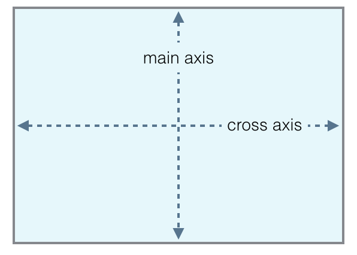 |
| **row** | 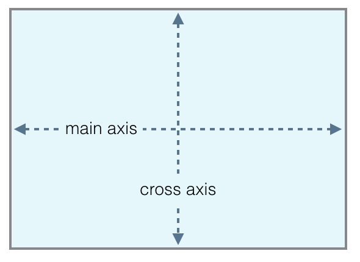 |

##### Sections

In the following sections we will see:

1. How to create, modify and defines flex containers and items.
2. Flexbox container's properties
3. Flexbox item's properties


:pushpin: This document is a guide that explains how to use FlexLayout. You can also checks the [**FlexLayout's API documentation**](https://layoutBox.github.io/FlexLayout/1.1/Classes/Flex.html).

<br>

<a name="create_modify_define_containers"></a>
## 1. Creation, modification and definition of flexbox items 

### addItem(:UIView)
- Applies to: `flex containers`
- Returns: FlexLayout interface of the newly added flex item.

**Method:**

* **`addItem(_: UIView) -> Flex`**  
This method adds a flex item (UIView) to a flex container. Internally this method adds the UIView as a subview and enables flexbox.

###### Usage examples:
```swift
  view.flex.addItem(imageView).width(100).aspectRatio(1)
```
<br>

### addItem()
- Applies to: `flex containers`
- Returns: FlexLayout interface of the newly created flex item.

**Method:**

* **`addItem() -> Flex`**  
This method is similar to `addItem(: UIView)` except that it also creates the flex item's UIView. Internally the method creates a UIView, adds it as a subview and enables flexbox. This is useful to add a flex item/container easily when you don't need to refer to it later.

###### Usage examples:
```swift
  view.flex.addItem().direction(.row).padding(10)
```
<br>

### define()
- Applies to: `flex containers`
- Parameter: Closure of type `(flex: Flex) -> Void`

**Method:**

* **`define(_ closure: (_ flex: Flex) -> Void)`**  
This method is used to structure your code so that it matches the flexbox structure. The method has a closure parameter with a single parameter called `flex`. This parameter is in fact the view's flex interface. It can be used to adds other flex items and containers. 

###### Usage examples:
```swift
  view.flex.addItem().define { (flex) in
      flex.addItem(imageView).grow(1)
		
      flex.addItem().direction(.row).define { (flex) in
          flex.addItem(titleLabel).grow(1)
          flex.addItem(priceLabel)
      }
  }
```

The same results can also be obtained without using the `define()` method, but the result is not as elegant:

```swift
  let columnContainer = UIView()
  columnContainer.flex.addItem(imageView).grow(1)
  view.flex.addItem(columnContainer)
		
  let rowContainer = UIView()
  rowContainer.flex.direction(.row)
  rowContainer.flex.addItem(titleLabel).grow(1)
  rowContainer.flex.addItem(priceLabel)
  columnContainer.flex.addItem(rowContainer)
```

**Advantages of using `define()`**:

- The source code structure matches the flexbox structure, making it easier to understand and modify.
	- Changing a flex item order, it's just moving up/down its line/block that defines it.
	- Moving a flex item from one container to another is just moving line/block that defines it.
- The structure looks more similar to how HTML and React Native defines it.
- Inside the `define`'s closure, you can do whatever you want to fill the flexbox container. You can use `for` loops, iterate arrays of data, call functions, ...
 
<br>
 
<a name="accessing_flexbox_view"></a>
### Accessing flex item's UIView 
It is possible to access the flex items's UIView using `flex.view`. This is particularly useful when using `flex.define()` method.

###### Example:
This example creates a flexbox container and sets its alpha to 0.8.

```swift
    view.flex.direction(.row).padding(20).alignItems(.center).define { (flex) in
        flex.addItem().width(50).height(50).define { (flex) in
            flex.view?.alpha = 0.8
        }
    }
``` 

Another possible solution:

```swift
    view.flex.direction(.row).padding(20).alignItems(.center).define { (flex) in
        let container = UIView()
        container.alpha = 0.8
        
        flex.addItem(container).width(50).height(50)
    }
``` 
<br>

### layout()
- Applies to: `flex containers`
- Values: `fitContainer` / `adjustWidth` / `adjustHeight`
- Default value: `fitContainer `

**Method:**

* **`layout(mode: LayoutMode = . fitContainer)`**  
The method will layout the flex container's children.

  Layout modes:

  * **`fitContainer`**: This is the default mode when no parameter is specified. Children are layouted **inside** the container's size (width and height). 
  * **`adjustHeight `**: In this mode, children are layouted **using only the container's width**. The container's height will be adjusted to fit the flexbox's children
  * **`adjustWidth `**: In this mode, children are layouted **using only the container's height**. The container's width will be adjusted to fit the flexbox's children

###### Usage examples:
```swift
  rootFlexContainer.flex.layout(mode: .adjustHeight)
```

<br>

<a name="containers_properties"></a>
## 2. Flexbox containers properties  
This section describes all flex container's properties.

### direction() 
- Applies to: `flex containers`
- Values: `column` / `columnReverse` / `row` / `rowReverse`
- Default value: `column`
- CSS name: `flex-direction` 

**Method:**

* **`direction(_: Direction)`**  
The `direction` property establishes the main-axis, thus defining the direction flex items are placed in the flex container.

  The `direction` property specifies how flex items are laid out in the flex container, by setting the direction of the flex container’s main axis. They can be laid out in two main directions, like columns vertically or like rows horizontally.

  Note that row and row-reverse are affected by the layout direction (see `layoutDirection` property) of the flex container. If its text direction is LTR (left to right), row represents the horizontal axis oriented from left to right, and row-reverse from right to left; if the direction is rtl, it's the opposite.


| Value | Result | Description |
|---------------------|:------------------:|---------|
| **column** (default) 	| 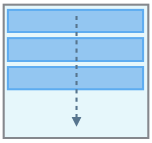| Top to bottom |
| **columnReverse** | | Bottom to top |
| **row** | | Same as text direction |
| **rowReverse** | | opposite to text direction |


###### Usage examples:
```swift
  view.flex.direction(.column)  // Not required, default value. 
  view.flex.direction(.row)
```

###### Example 1:
This example center three buttons with a margin of 10 pixels between them.  
[Example source code](https://github.com/layoutBox/FlexLayout/blob/master/Example/FlexLayoutSample/UI/Examples/Example1/Example1View.swift)

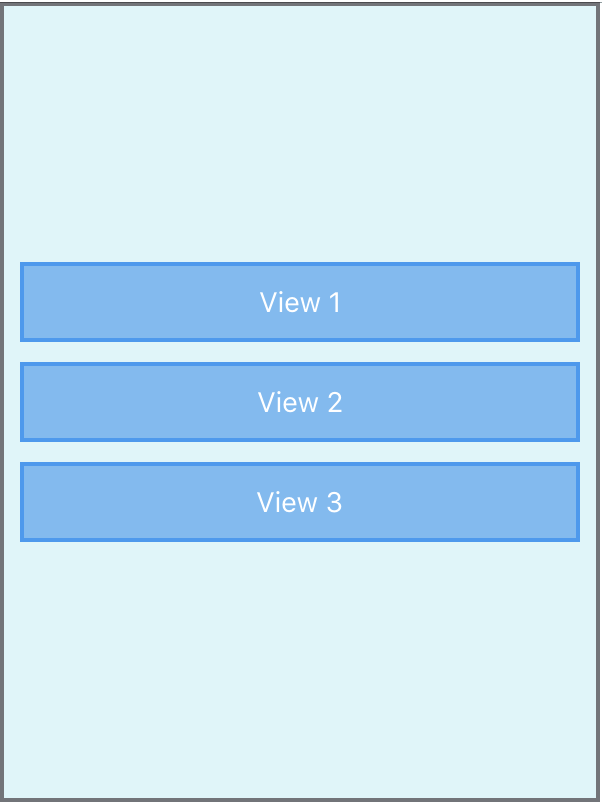

```swift
    rootFlexContainer.flex.justifyContent(.center).padding(10).define { (flex) in
        flex.addItem(button1)
        flex.addItem(button2).marginTop(10)
        flex.addItem(button3).marginTop(10)
    }
``` 

<br/>

### justifyContent()
- Applies to: `flex containers`
- Values: `start` / `end` / `center` / `spaceBetween` / `spaceAround` / `spaceEvenly`
- Default value: `start`
- CSS name: `justify-content` 

**Method:**

* **`justifyContent(_: JustifyContent)`**  
The `justifyContent` property defines the alignment along the main-axis of the current line of the flex container. It helps distribute extra free space leftover when either all the flex items on a line have reached their maximum size. For example, if children are flowing vertically, `justifyContent` controls how they align vertically. 

|                     	| direction(.column) | direction(.row) | |
|---------------------	|:------------------:|:---------------:|:--|
| **start** (default) 	| | | Items are packed at the beginning of the main-axis. |
| **end**	| | | Items are packed at the end of the main-axis. |
| **center** 	| | | items are centered along the main-axis. |
| **spaceBetween** 	| |  | Items are evenly distributed in the main-axis; first item is at the beginning, last item at the end. |
| **spaceAround** 	|  | 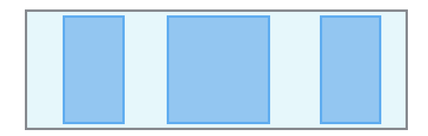 | Items are evenly distributed in the main-axis with equal space around them. |
| **spaceEvenly** 	| 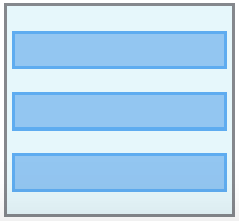 | 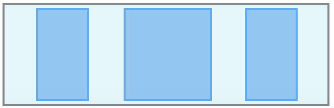 | Items are evenly distributed in the main-axis with equal space around them. |

###### Usage examples:
```swift
  view.flex.justifyContent(.start)  // default value. 
  view.flex.justifyContent(.center)
```
<br/>

### alignItems()
- Applies to: `flex containers`
- Values: `stretch` / `start` / `end` / `center` / `baseline`
- Default value: `stretch `
- CSS name: `align-items` 

**Method:**

* **`alignItems(_: AlignItems)`**  
The `alignItems` property defines how flex items are laid out along the cross axis on the current line. Similar to `justifyContent` but for the cross-axis (perpendicular to the main-axis). For example, if children are flowing vertically, `alignItems` controls how they align horizontally. 


|                     	| direction(.column) | direction(.row) |
|---------------------	|:------------------:|:---------------:|
| **stretch** (default) 	| 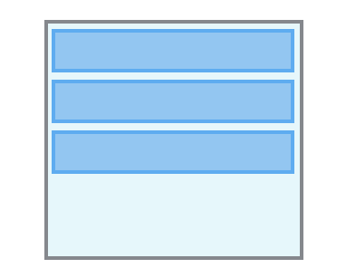| 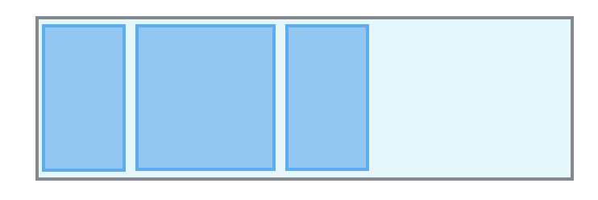|
| **start**	| 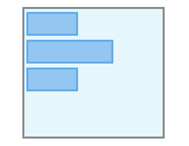| |
| **end**	| | |
| **center** 	| | |


<br/>

### alignSelf()
- Applies to: `flex containers`
- Values: `auto` / `stretch` / `start` / `end` / `center` / `baseline`
- Default value: `auto`
- CSS name: `align-self` 

**Method:**

* **`alignSelf(_: AlignSelf)`**  
The `alignSelf` property controls how a child aligns in the cross direction, overriding the `alignItems` of the parent. For example, if children are flowing vertically, `alignSelf` will control how the flex item will align horizontally. 

The `auto` value means use the flex container `alignItems` property. See `alignItems` for documentation of the other values.

<br/>

### wrap()
- Applies to: `flex containers`
- Values: `noWrap` / `wrap` / `wrapReverse`
- Default value: `noWrap`
- CSS name: `flex-wrap` 

**Method:**

* **`wrap(_: Wrap)`**  
The `wrap` property controls whether the flex container is single-lined or multi-lined, and the direction of the cross-axis, which determines the direction in which the new lines are stacked in.

By default, the flex container fits all flex items into one line. Using this property we can change that. We can tell the container to lay out its items in single or multiple lines, and the direction the new lines are stacked in

Reminder: the cross axis is the axis perpendicular to the main axis. Its direction depends on the main axis direction.


|                     	| direction(.column) | direction(.row) | Description|
|---------------------	|:------------------:|:---------------:|--------------|
| **noWrap** (default) 	| 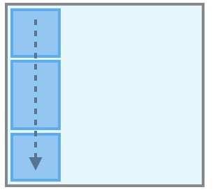| | Single-line which may cause the container to overflow. NEW: Flex items are displayed in one row and by default they are shrunk to fit the flex container’s width |
| **wrap** | | | Multi-lines, direction is defined by `direction()`. NEW: Flex items are displayed in multiple rows if needed from left-to-right and top-to-bottom  |
| **wrapReverse**	| 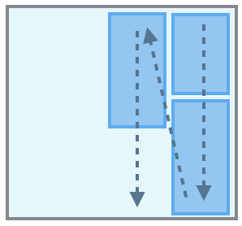| | Multi-lines, opposite to direction defined by `direction()`. NEW: Flex items are displayed in multiple rows if needed from left-to-right and bottom-to-top |

###### Usage examples:
```swift
  view.flex.wrap(.nowrap)  // Not required, default value. 
  view.flex.wrap(.wrap)
```
<br/>

### alignContent()
- Applies to: `flex containers`
- Values: `start` / `end` / `center` / `stretch` / `spaceBetween` / `spaceAround`
- Default value: `start`
- CSS name: `align-content`  

**Method:**

* **`alignContent(_: AlignContent)`**  
The align-content property aligns a flex container’s lines within the flex container when there is extra space in the cross-axis, similar to how justifyContent aligns individual items within the main-axis.

Note, `alignContent` has no effect when the flexbox has only a single line.


|                     	| direction(.column) | direction(.row) |
|---------------------	|:------------------:|:---------------:|
| **start** (default) 	| | |
| **end**	| | 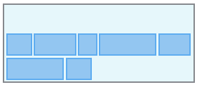|
| **center** 	| 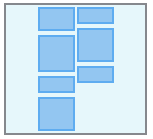| |
| **stretch**	| | 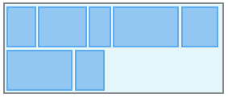|
| **spaceBetween** |  | 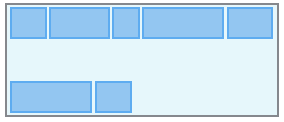|
| **spaceAround** |  | 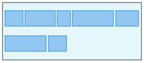|

<br/>


### layoutDirection()

FlexLayout supports left-to-right (LTR) and right-to-left (RTL) languages.

Using `start` or `end` properties, you can position views without having to think about whether your item will show up on the left or the right side of the screen (depending on the person’s language 

**Method:**

* **`layoutDirection(_: LayoutDirection)`**  
The `layoutDirection` property controls the flex container layout direction. 

  Values:
  * **`.inherit`**  
Direction defaults to Inherit on all nodes except the root which defaults to LTR. It is up to you to detect the user’s preferred direction (most platforms have a standard way of doing this) and setting this direction on the root of your layout tree.
  * **`.ltr`**: Layout views from left to right. (Default)
  * **`.rtl`**: Layout views from right to left.

<br>

<a name="intems_properties"></a>
## 3. Flexbox items properties 
This section describe all flex items's properties.

:pushpin: Remembers that flex containers are also flex items, so all these properties also apply to containers.

### grow 
- Applies to: `flex items`
- Default value: 0
- CSS name: `flex-grow` 

**Method:**

* **`grow(_: CGFloat)`**  
The `grow` property defines the ability for a flex item to grow if necessary. It accepts a unitless value that serves as a proportion. It dictates what amount of the available space inside the flex container the item should take up.

  A grow value of 0 (default value) keeps the view's size in the main-axis direction. If you want the view to use the available space set a grow value > 0.

For example, if all items have `grow` set to 1, every child will set to an equal size inside the container. If you were to give one of the children a value of 2, that child would take up twice as much space as the others.

<br>

### shrink
- Applies to: `flex items`
- Default value: 0
- CSS name: `flex-shrink` 

**Method:**

* **`shrink(_: CGFloat)`**  
It specifies the "flex shrink factor", which determines how much the flex item will shrink relative to the rest of the flex items in the flex container when there isn't enough space on the main-axis.
  
  When omitted, it is set to 0 and the flex shrink factor is multiplied by the flex `basis` when distributing negative space.

  A shrink value of 0 keeps the view's size in the main-axis direction. Note that this may cause the view to overflow its flex container.
  
  Shrink is about proportions. If an item has a shrink of 3, and the rest have a shrink of 1, the item will shrink 3x as fast as the rest.

<br>

### basis
- Applies to: `flex items `
- Default value: 0
- CSS name: `flex-basis` 

**Method:**

* **`basis(_ : CGFloat?)`**   
This property takes the same values as the width and height properties, and specifies the initial size of the flex item, before free space is distributed according to the grow and shrink factors. 

  Specifying `nil` set the basis as `auto`, which means the length is equal to the length of the item. If the item has no length specified, the length will be according to its content 

* **`basis(_ : FPercent)`**   
This property takes the same values as the width and height properties, and specifies the initial size of the flex item, before free space is distributed according to the grow and shrink factors. 


<br>

### isIncludedInLayout()
- Applies to: `flex items`

**Method:**

* **`isIncludedInLayout(_ value: Bool)`**  
This property controls dynamically if a flexbox's UIView is included or not in the flexbox layouting. When a flexbox's UIView is excluded, FlexLayout won't layout the view and its children views.

FlexLayout automatically includes the UIView when:
* The first time `UIView.flex` property is accessed
* When a child view is added to a flexbox container using `addItem(:UIView)` or `addItem()`

<br>

### display
- Applies to: `flex items`

**Method:**

* **`display(_: Display)`**  

Set the item display or not, with `none` value, the item will be hidden and not included in the layout.

<br>

### markDirty()
- Applies to: `flex items`

**Method:**

* **`markDirty()`**  
The framework is so highly optimized, that flex items are layouted only when a flex property is changed and when flex container size change. In the event that you want to force FlexLayout to do a layout of a flex item, you can mark it as dirty using `markDirty()`. 

  Dirty flag propagates to the root of the flexbox tree ensuring that when any item is invalidated its whole subtree will be re-calculated.

###### Usage examples:
In the case where a UILabel's text is updated, it is needed to mark the label as dirty and relayout the flex container.

```swift
    // 1) Update UILabel's text
    label.text = "I love FlexLayout"
     
    // 2) Mark the UILabel as dirty
    label.flex. markDirty()
    
    // 3) Then force a relayout of the flex container.
    rootFlexContainer.flex.layout()
    OR
    setNeedsLayout()
```

<br>

### sizeThatFits()
- Applies to: `flex items`

**Method:**

* **`sizeThatFits()`**  
Returns the item size when layouted in the specified frame size.

###### Usage Example:
Get the size of view when layouted in a container with a width of 200 pixels.

```swift
    let layoutSize = viewA.flex.sizeThatFits(size: CGSize(width: 200, height: CGFloat.greatestFiniteMagnitude))
```

<br>

### intrinsicSize
- Applies to: `flex items`

**Property:**

* **`intrinsicSize`**  
Item natural size, considering only properties of the view itself. Independent of the item frame.

<br>

<a name="absolute_positioning"></a>
## 4. Absolute positioning  
- Applies to: `flex items`
- Parameter: CGFloat

**Method:**

* **`position(_: Position)`**   
The position property tells Flexbox how you want your item to be positioned within its parent. Position values:
  * **`relative (default)`**
  * **`absolute`**: The view is positioned using properties: top(), bottom(), left(), right(), start(), end().

###### Usage examples:
```swift
  view.flex.position(.absolute).top(10).left(10).size(50)
```

### top(), bottom(), left(), right(), start(), end(), vertically(), horizontally(), all()
A flex item which is `position` is set to `.absolute` is positioned absolutely in regards to its parent. This is done through the following methods:

**Methods:**

* **`top(: CGFloat)`** / **`top(: FPercent)`**:  
Controls the distance a child’s top edge is from the parent’s top edge.
* **`bottom(: CGFloat)`** / **`bottom(: FPercent)`**:  
Controls the distance a child’s bottom edge is from the parent’s bottom edge.
* **`left(: CGFloat)`** / **`left(: FPercent)`**:  
Controls the distance a child’s left edge is from the parent’s left edge.
* **`right(: CGFloat)`** / **`right(: FPercent)`**:  
Controls the distance a child’s right edge is from the parent’s right edge.
* **`start(: CGFloat)`** / **`start(: FPercent)`**:  
Controls the distance a child’s start edge is from the parent’s start edge. In left-to-right direction (LTR), it corresponds to the `left()` property and in RTL to `right()` property.
* **`end(: CGFloat)`** / **`end(: FPercent)`**:  
Controls the distance a child’s end edge is from the parent’s end edge. In left-to-right direction (LTR), it corresponds to the `right()` property and in RTL to `left()` property.
* **`vertically(: CGFloat)`** / **`vertically(: FPercent)`**:  
Controls the distance child’s top and bottom edges from the parent’s edges. Equal to `top().bottom()`.
* **`horizontally(: CGFloat)`** / **`horizontally(: FPercent)`**:  
Controls the distance child’s left and right edges from the parent’s edges. Equal to `left().right()`.
* **`all(: CGFloat)`** / **`all(: FPercent)`**:  
Controls the distance child’s edges from the parent’s edges. Equal to `top().bottom().left().right()`.

Using these properties you can control the size and position of an absolute item within its parent. Because absolutely positioned children don’t affect their sibling's layout. Absolute position can be used to create overlays and stack children in the Z axis.

###### Usage examples:
```swift
  view.flex.position(.absolute).top(10).right(10).width(100).height(50)
  view.flex.position(.absolute).left(20%).right(20%)
```
:pushpin: See the "Yoga C" example in the [Examples App](#examples_app). [Source code](https://github.com/layoutBox/FlexLayout/blob/master/Example/FlexLayoutSample/UI/Examples/YogaExampleC/YogaExampleCView.swift)

<br>

<a name="adjusting_size"></a> 
## 5. Adjusting the size  

<a name="width_height_size"></a>
### Width and height and size 

FlexLayout has methods to set the view’s height and width.

**Methods:**

* **`width(_ width: CGFloat?)`**  
The value specifies the view's width in pixels. The value must be non-negative. Call `width(nil)` to reset the property.
* **`width(_ percent: FPercent)`**  
The value specifies the view's width in percentage of its container width. The value must be non-negative. Call `width(nil)` to reset the property.
* **`height(_ height: CGFloat?)`**  
The value specifies the view's height in pixels. The value must be non-negative. Call `height(nil)` to reset the property.
* **`height(_ percent: FPercent)`**  
The value specifies the view's height in percentage of its container height. The value must be non-negative. Call `height(nil)` to reset the property.
* **`size(_ size: CGSize?)`**  
The value specifies view's width and the height in pixels. Values must be non-negative. Call `size(nil)` to reset the property.
* **`size(_ sideLength: CGFloat?)`**  
The value specifies the width and the height of the view in pixels, creating a square view. Values must be non-negative. Call `size(nil)` to reset the property.


###### Usage examples:
```swift
  view.flex.width(100)	
  view.flex.width(50%)	
  view.flex.height(200)
	
  view.flex.size(250)
```
<br>

<a name="minmax_width_height_size"></a>
### minWidth(), maxWidth(), minHeight(), maxHeight() 

FlexLayout has methods to set the view’s minimum and maximum width, and minimum and maximum height. 

Using minWidth, minHeight, maxWidth, and maxHeight gives you increased control over the final size of items in a layout. By mixing these properties with `grow`, `shrink`, and `alignItems(.stretch)`, you are able to have items with dynamic size within a range which you control.

An example of when Max properties can be useful is if you are using `alignItems(.stretch)` but you know that your item won’t look good after it increases past a certain point. In this case, your item will stretch to the size of its parent or until it is as big as specified in the Max property.

Same goes for the Min properties when using `shrink`. For example, you may want children of a container to shrink to fit on one row, but if you specify a minimum width, they will break to the next line after a certain point (if you are using `wrap(.wrap)`.

Another case where Min and Max dimension constraints are useful is when using `aspectRatio`.


**Methods:**

* **`minWidth(_ width: CGFloat?)`**  
The value specifies the view's minimum width of the view in pixels. The value must be non-negative. Call `minWidth(nil)` to reset the property.
* **`minWidth(_ percent: FPercent)`**  
The value specifies the view's minimum width of the view in percentage of its container width. The value must be non-negative. Call `minWidth(nil)` to reset the property..
* **`maxWidth(_ width: CGFloat?)`**  
The value specifies the view's maximum width of the view in pixels. The value must be non-negative. Call `maxWidth(nil)` to reset the property.
* **`maxWidth(_ percent: FPercent)`**  
The value specifies the view's maximum width of the view in percentage of its container width. The value must be non-negative. Call `maxWidth(nil)` to reset the property.
* **`minHeight(_ height: CGFloat?)`**  
The value specifies the view's minimum height of the view in pixels. The value must be non-negative. Call `minHeight(nil)` to reset the property.
* **`minHeight(_ percent: FPercent)`**  
The value specifies the view's minimum height of the view in percentage of its container height. The value must be non-negative. Call `minHeight(nil)` to reset the property.
* **`maxHeight(_ height: CGFloat?)`**  
The value specifies the view's maximum height of the view in pixels. The value must be non-negative. Call `maxHeight(nil)` to reset the property.
* **`maxHeight(_ percent: FPercent)`**  
The value specifies the view's maximum height of the view in percentage of its container height. The value must be non-negative. Call `maxHeight(nil)` to reset the property.
   
###### Usage examples:
```swift
  view.flex.maxWidth(200)
  view.flex.maxWidth(50%)
  view.flex.width(of: view1).maxWidth(250)
	
  view.flex.maxHeight(100)
  view.flex.height(of: view1).maxHeight(30%)
```
<br>

<a name="aspect_ratio"></a>
### aspectRatio() 
AspectRatio is a property introduced by Yoga that don't exist in CSS. AspectRatio solves the problem of knowing one dimension of an element and an aspect ratio, this is very common when it comes to images, videos, and other media types. AspectRatio accepts any floating point value > 0, the default is undefined.

* AspectRatio is defined as the ratio between the width and the height of a node e.g. if a node has an aspect ratio of 2 then its width is twice the size of its height.
* AspectRatio respects the Min and Max dimensions of an item.
* AspectRatio has higher priority than `grow`.
* If AspectRatio, Width, and Height are set then the cross dimension is overridden
* Call `aspectRatio(nil)` to reset the property.

   
###### Usage examples:
```swift
  imageView.flex.aspectRatio(16/9)
```
<br/>


<a name="margins"></a>
## 6. Margins 
By applying Margin to an item you specify the offset a certain edge of the item should have from it’s closest sibling or parent.

**Methods:**

* **`marginTop(_ value: CGFloat)`, `marginTop(_ percent: FPercent)`**  
Top margin specify the offset the top edge of the item should have from it’s closest sibling (item) or parent (container).
* **`marginLeft(_ value: CGFloat)`, `marginLeft(_ percent: FPercent)`**  
Left margin specify the offset the left edge of the item should have from it’s closest sibling (item) or parent (container).
* **`marginBottom(_ value: CGFloat)`, `marginBottom(_ percent: FPercent)`**  
Bottom margin specify the offset the bottom edge of the item should have from it’s closest sibling (item) or parent (container)
* **`marginRight(_ value: CGFloat)`, `marginRight(_ percent: FPercent)`**  
Right margin specify the offset the right edge of the item should have from it’s closest sibling (item) or parent (container).
* **`marginStart(_ value: CGFloat)`, `marginStart(_ percent: FPercent)`**  
Set the start margin. In LTR direction, start margin specify the **left** margin. In RTL direction, start margin specify the **right** margin.
* **`marginEnd(_ value: CGFloat)`, `marginEnd(_ percent: FPercent)`**  
Set the end margin. In LTR direction, end margin specify the **right** margin. In RTL direction, end margin specify the **left** margin.
* **`marginHorizontal(_ value: CGFloat)`, `marginHorizontal(_ percent: FPercent)`**  
Set the left, right, start and end margins to the specified value.
* **`marginVertical(_ value: CGFloat)`, `marginVertical(_ percent: FPercent)`**  
Set the top and bottom margins to the specified value.
* **`margin(_ insets: UIEdgeInsets)`**
Set all margins using an UIEdgeInsets. This method is particularly useful to set all margins using iOS 11 `UIView.safeAreaInsets`.
* **`margin(_ insets: NSDirectionalEdgeInsets)`**
Set all margins using an NSDirectionalEdgeInsets. This method is useful to set all margins using iOS 11 `UIView. directionalLayoutMargins` when layouting a view supporting RTL/LTR languages.
* **`margin(_ value: CGFloat) `**  
Set all margins to the specified value.
* **`margin(_ vertical: CGFloat, _ horizontal: CGFloat)`**
* **`margin(_ top: CGFloat, _ horizontal: CGFloat, _ bottom: CGFloat)`**
* **`margin(_ top: CGFloat, _ left: CGFloat, _ bottom: CGFloat, _ right: CGFloat)`**

###### Usage examples:
```swift
  view.flex.margin(20)
  view.flex.marginTop(20%).marginLeft(20%)
  view.flex.marginHorizontal(20)
  view.flex.margin(safeAreaInsets)
  view.flex.margin(10, 12, 0, 12)
```

<br>

<a name="paddings"></a>
## 7. Paddings 

Padding specify the **offset children should have** from a certain edge on the container. 

**Methods:**

* **`paddingTop(_ value: CGFloat)`, `paddingTop(_ percent: FPercent)`**
* **`paddingLeft(_ value: CGFloat)`, `paddingLeft(_ percent: FPercent)`**
* **`paddingBottom(_ value: CGFloat)`, `paddingBottom(_ percent: FPercent)`**
* **`paddingRight(_ value: CGFloat)`, `paddingRight(_ percent: FPercent)`**
* **`paddingStart(_ value: CGFloat)`, `paddingStart(_ percent: FPercent)`**
* **`paddingEnd(_ value: CGFloat)`, `paddingEnd(_ percent: FPercent)`**
* **`paddingHorizontal(_ value: CGFloat)`, `paddingHorizontal(_ percent: FPercent)`**
* **`paddingVertical(_ value: CGFloat)`, `paddingVertical(_ percent: FPercent)`**
* **`padding(_ insets: UIEdgeInsets)`** 
Set all paddings using an UIEdgeInsets. This method is particularly useful to set all paddings using iOS 11 `UIView.safeAreaInsets`.
* **`padding(_ insets: NSDirectionalEdgeInsets)`**  
Set all paddings using an NSDirectionalEdgeInsets. This method is particularly useful to set all padding using iOS 11 `UIView. directionalLayoutMargins` when layouting a view supporting RTL/LTR languages.
* **`padding(_ value: CGFloat)`, `padding(_ percent: FPercent)`**
* **`padding(_ vertical: CGFloat, _ horizontal: CGFloat)`, `padding(_ vertical: FPercent, horizontal: FPercent`**
* **`padding(_ top: CGFloat, _ horizontal: CGFloat, _ bottom: CGFloat)`,  `padding(_ top: FPercent, _ horizontal: FPercent, _ bottom: FPercent)`**
* **`padding(_ top: CGFloat, _ left: FPercent, _ bottom: FPercent, _ right: FPercent)`, `padding(_ top: FPercent, _ left: FPercent, _ bottom: FPercent, _ right: FPercent)`**


###### Usage examples:
```swift
  view.flex.padding(20)
  view.flex.paddingTop(20%).paddingLeft(20%)
  view.flex.paddingBottom(20)
  view.flex.paddingHorizontal(20)
  view.flex.padding(10, 12, 0, 12)
```

<br>

<a name="uiview_methods"></a>
## 9. Extra UIView methods 
FlexLayout also adds methods to set common UIView properties.

**Methods:**

* **`backgroundColor(_ color: UIColor)`**  
Set the flex item's UIView background color. 

###### Usage examples:
```swift
  // Create a gray column container and add a black horizontal line separator 
  flex.addItem().backgroundColor(.gray).define { (flex) in
      flex.addItem().height(1).backgroundColor(.black)
  } 
```

<br>

<a name="api_documentation"></a>
## FlexLayout API Documentation 
The [**complete FlexLayout API is available here**](https://layoutBox.github.io/FlexLayout/1.1/Classes/Flex.html). 

<br>

<a name="examples_app"></a>
## Example App 
The FlexLayout's Example App exposes some usage example of FlexLayout.   
[See the Example App section to get more information](docs_markdown/examples.md).

<a href="https://github.com/layoutBox/FlexLayout/blob/master/Example/FlexLayoutSample/UI/Examples/Intro/IntroView.swift"></a>
<a href="https://github.com/layoutBox/FlexLayout/blob/master/Example/FlexLayoutSample/UI/Examples/RaywenderlichTutorial/RaywenderlichTutorialView.swift"></a>
<a href="https://github.com/layoutBox/FlexLayout/blob/master/Example/FlexLayoutSample/UI/Examples/TableViewExample">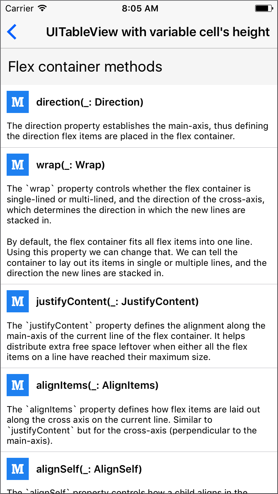</a>
<a href="https://github.com/layoutBox/FlexLayout/blob/master/Example/FlexLayoutSample/UI/Examples/CollectionViewExample/HouseCell.swift"></a>
<a href="https://github.com/layoutBox/FlexLayout/blob/master/Example/FlexLayoutSample/UI/Examples/YogaExampleA/YogaExampleAView.swift">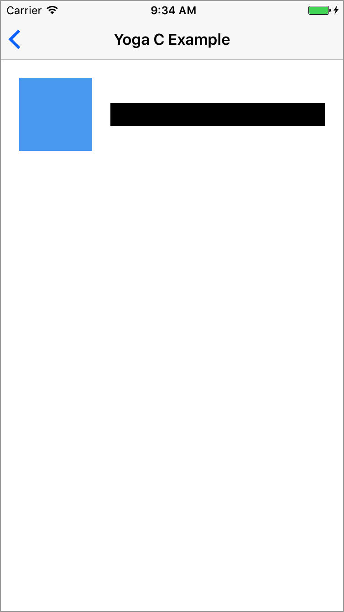</a>
<a href="https://github.com/layoutBox/FlexLayout/blob/master/Example/FlexLayoutSample/UI/Examples/YogaExampleB/YogaExampleBView.swift"></a>
<a href="https://github.com/layoutBox/FlexLayout/blob/master/Example/FlexLayoutSample/UI/Examples/YogaExampleC/YogaExampleCView.swift">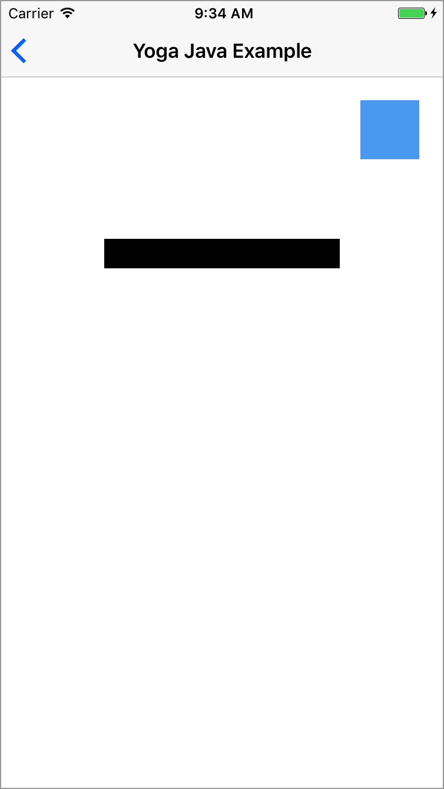</a>
<a href="https://github.com/layoutBox/FlexLayout/blob/master/Example/FlexLayoutSample/UI/Examples/YogaExampleD/YogaExampleDView.swift"></a>
<a href="https://github.com/layoutBox/FlexLayout/blob/master/Example/FlexLayoutSample/UI/Examples/YogaExampleE/YogaExampleEView.swift">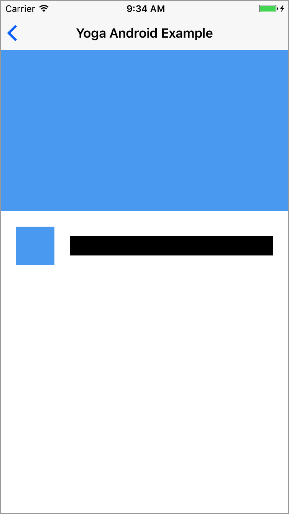</a>

<br>


<a name="faq"></a>
## FAQ 

*  **Q: The flex item overflows or is bigger than its container?**  
   **A:** By default the flex item's `shrink` value is 0, which keeps the item's current size in the main-axis direction. So that may cause the item to overflow its flex container. To fix that you just have to specify a `shrink` value bigger than 0:  
```
   view.flex.shrink(1)
```


*  **Q: How to keep the view size (width/height)?**  
   **A:** By default view's flex shrink value is set to 1, which reduce the size of the view if the view is bigger than its flex container in the main-axis direction. If the direction is column, the height is adjusted, if the direction is row, the width is adjusted. Setting this value to 0 will keep the view size in the main-axis direction.

* **Q: How to apply percentage from a CGFloat, a Float or an Int value?**  
  **R:** Few FlexLayout's method has a parameter of type `FPercent`. You can easily specify this type of parameter simply by adding the `%` operator to your value (eg: `view.flex.width(25%)`. It is similar if you have a value of type CGFloat, Float or Int, simply adds the `%` operator:  
  
	```swift
	let percentageValue: CGFloat = 50
	view.flex.height(percentageValue%)
	``` 

<br/>

## Flexbox interesting external links
* [Introduction to Flexbox using Yoga](https://yogalayout.com/)
* [THE flexbox CSS reference: A Complete Guide to Flexbox](https://css-tricks.com/snippets/css/a-guide-to-flexbox/)
* [Raywenderlich interesting Yoga tutorial](https://www.raywenderlich.com/161413/yoga-tutorial-using-cross-platform-layout-engine)
* [An Introduction to Flexbox CSS](https://slicejack.com/introduction-to-flexbox/)
* [Flex Cheatsheet: Test flexbox properties using CSS](https://yoksel.github.io/flex-cheatsheet)
* [Mozialla: Advanced layouts with flexbox using CSS](https://developer.mozilla.org/en-US/docs_markdown/Web/CSS/CSS_Flexible_Box_Layout/Advanced_layouts_with_flexbox)

<br/>

<a name="comments"></a>
## Contributing, comments, ideas, suggestions, issues, .... 
For any **comments**, **ideas**, **suggestions**, simply open an [issue](https://github.com/layoutBox/FlexLayout/issues). 

For **issues**, please have a look at [Yoga's issues](https://github.com/facebook/yoga/issues). Your issue may have been already reported. If not, it may be a FlexLayout issue. In this case open an issue and we'll let you know if the issue is related to Yoga's implementation. 

If you find FlexLayout interesting, thanks to **Star** it. You'll be able to retrieve it easily later.

If you'd like to contribute, you're welcome!

<br>

<a name="installation"></a>
## Installation 

### CocoaPods

To integrate FlexLayout into your Xcode project using CocoaPods, specify it in your `Podfile`:

```ruby
  pod 'FlexLayout'
```

Then, run `pod install`.


### Carthage

To integrate FlexLayout into your Xcode project using Carthage:

1. Specify in your `Cartfile`:  
```
github "layoutBox/FlexLayout"
```

2. Run `carthage update` to build frameworks.
3. Add built `FlexLayout.framework` in your Xcode project in the **Embedded Binaries** section. 


### Swift Package Manager

#### Another Swift Package

To integrate FlexLayout into another Swift Package, add it as a dependency:

```
.package(url: "https://github.com/layoutBox/FlexLayout.git", from: "1.3.18")
```

#### In an Xcode target

1. To integrate FlexLayout into an Xcode target, use the `File -> Swift Packages -> Add Package Dependency` menu item.
2. Add "FLEXLAYOUT_SWIFT_PACKAGE=1" to the Xcode target's `GCC_PREPROCESSOR_DEFINITIONS` build setting. (TARGET -> Build Settings -> Apple Clang-Preprocessing -> Preprocessor Macros)


<br/>

## Changelog
FlexLayout recent history is available in the are documented in the [CHANGELOG](CHANGELOG.md).

<br>

## License
MIT License 

